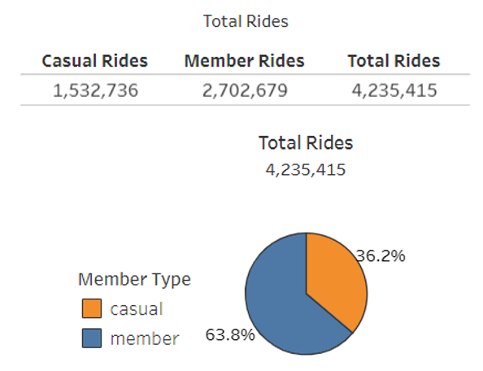
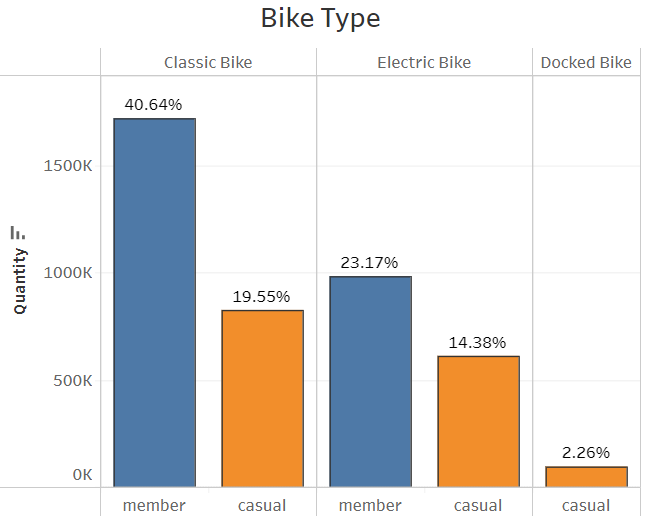
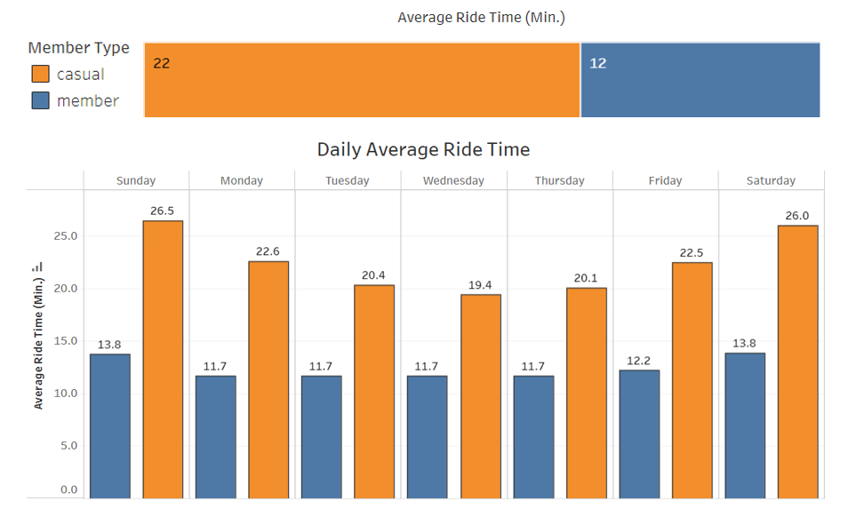
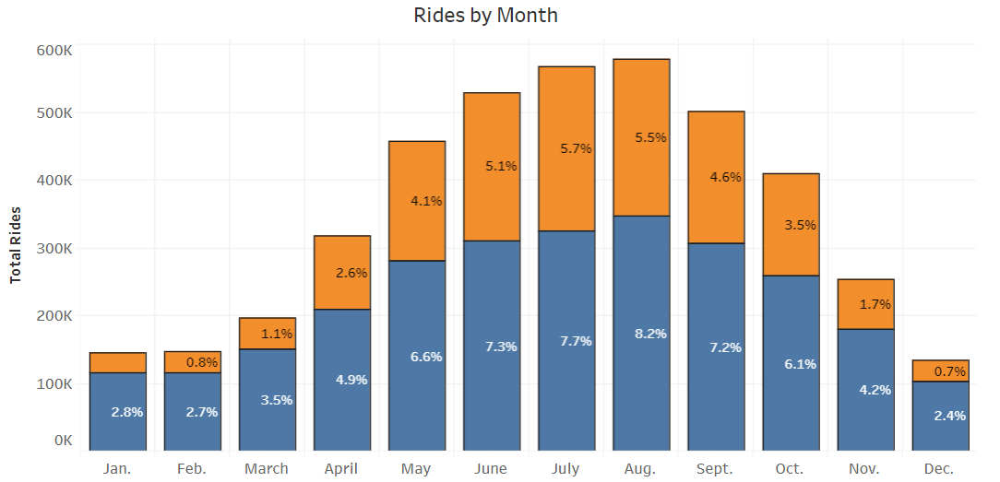
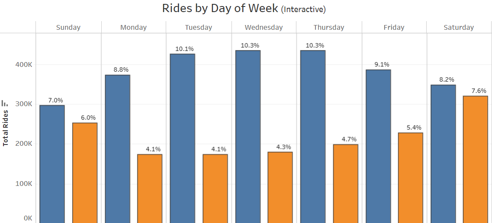
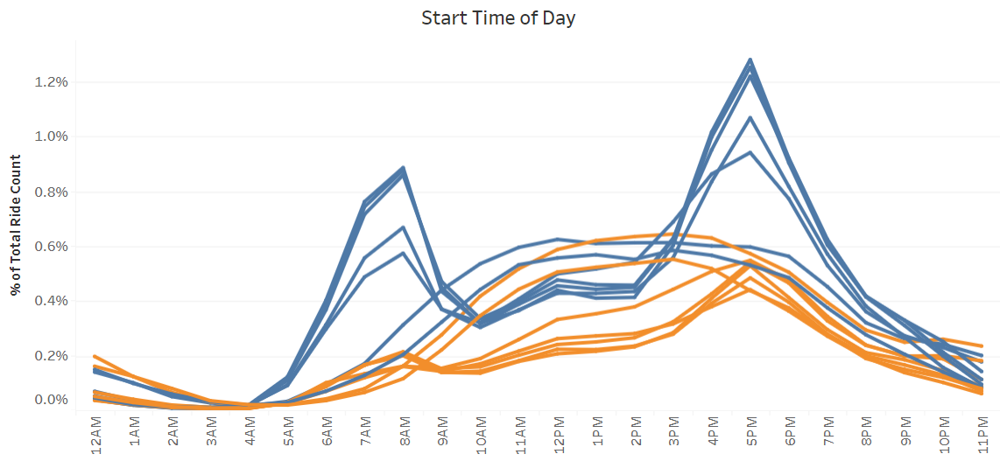
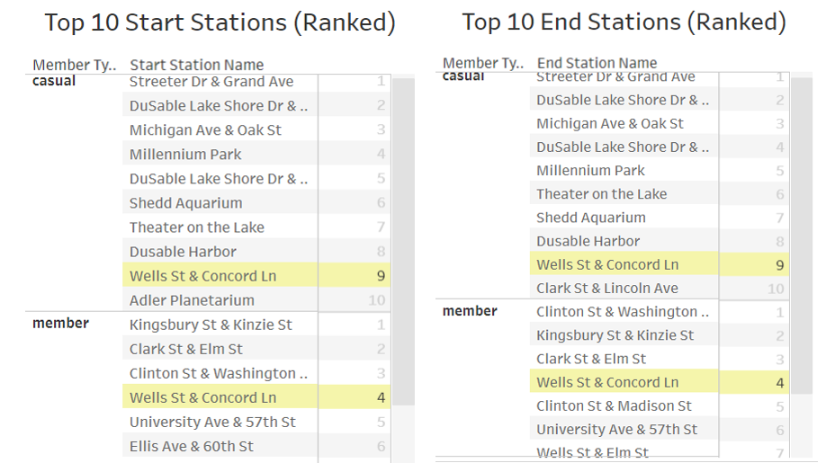

# **Cyclistic Bike Share Analysis**

# **Introduction**
This is a capstone project for the Google Data Analytics Professional Certificate. In this case study, I am a junior data analyst for a fictional bike share company called Cyclistic.  

## **Scenario**
You are a junior data analyst working in the marketing analyst team at Cyclistic, a bike-share company in Chicago. The director of marketing believes the company’s future success depends on maximizing the number of annual memberships. Therefore, your team wants to understand how casual riders and annual members use Cyclistic bikes differently. From these insights, your team will design a new marketing strategy to convert casual riders into annual members. But first, Cyclistic executives must approve your recommendations, so they must be backed up with compelling data insights and professional data visualizations.  

## **About the Company**
In 2016, Cyclistic launched a successful bike-share offering. Since then, the program has grown to a fleet of 5,824 bicycles that are geotracked and locked into a network of 692 stations across Chicago. The bikes can be unlocked from one station and returned to any other station in the system anytime.   

Until now, Cyclistic’s marketing strategy relied on building general awareness and appealing to broad consumer segments. One approach that helped make these things possible was the flexibility of its pricing plans: single-ride passes, full-day passes, and annual memberships. Customers who purchase single-ride or full-day passes are referred to as casual riders. Customers who purchase annual memberships are Cyclistic members.   

Cyclistic’s finance analysts have concluded that annual members are much more profitable than casual riders. Although the pricing flexibility helps Cyclistic attract more customers, Moreno, the director of marketing, believes that maximizing the number of annual members will be key to future growth. Rather than creating a marketing campaign that targets all-new customers, Moreno believes there is a very good chance to convert casual riders into members. She notes that casual riders are already aware of the Cyclistic program and have chosen Cyclistic for their mobility needs. Moreno and her team are interested in analyzing the Cyclistic historical bike trip data to identify trends.  

# **Ask**
Three questions will guide the future marketing program: 
1.	How do annual members and casual riders use Cyclistic bikes differently? 
2.	Why would casual riders buy Cyclistic annual memberships? 
3.	How can Cyclistic use digital media to influence casual riders to become members?   

## **Business Task**
Design marketing strategies aimed at converting casual riders into annual members. In order to do that, the marketing analyst team needs to better understand how annual members and casual riders differ, why casual riders would buy a membership, and how digital media could affect their marketing tactics.  

## **Deliverables**
You will produce a report with the following: 
1.	A clear statement of the business task 
2.	A description of all data sources used 
3.	Documentation of any cleaning or manipulation of data 
4.	A summary of your analysis 
5.	Supporting visualizations and key findings 
6.	Your top three recommendations based on your analysis  

## **Key Stakeholders**
•	Lily Moreno: The director of marketing and your manager.  
•	Cyclistic marketing analytics team: A team of data analysts who are responsible for collecting, analyzing, and reporting data.  
•	Cyclistic executive team.    

# **Prepare**
Collect and prepare the data for analysis.  

## **Data Source**
The data used can be found **[here](https://divvy-tripdata.s3.amazonaws.com/index.html)**. For this case study, I will use the past 12 months of bike trip data, ranging from 10/1/2022 – 09/30/2023. The data has been made available by Motivate International Inc. under this **[license](https://divvybikes.com/data-license-agreement)**.    

The dataset consists of 12 CSV files, one for each month, containing records of every ride made by a casual or member customer of Cyclistic. The data has been partially pre-processed by Motivate International Inc. to remove trips that are taken by staff as they service and inspect the system Each file contains 13 columns with the following information:   

•	**Ride_id**: Unique id for each individual ride  
•	**Rideable_type**: Type of bike rode: classic, electric, or docked bike  
•	**Started_at**: Starting date and time of ride  
•	**Ended_at**: Ending date and time of ride  
•	**Start_station_name**: Name of station where ride began  
•	**Start_station_id**: Unique id for station where ride began  
•	**End_station_name**: Name of station where ride ended  
•	**End_station_id**: Unique id for station where ride ended  
•	**Start_lat**: Starting latitude  
•	**Start_long**: Starting longitude  
•	**End_lat**: Ending latitude  
•	**End_long**: Ending longitude   
•	**Member_casual**: Customer type: member or casual    

# **Process**  

## **Tools Used**  
For this case study, BigQuery was used to import, manage, and clean all the data. With datasets this large, a Relational Database Management Systems (RDBMS) such as BigQuery, is very helpful as it can process large datasets using Structured Query Language (SQL) quickly and efficiently. It also provides the tools and functions needed for processing and analyzing data. 

## **Import and Clean Data**  

Before the data is analyzed, it needs to be cleaned, transformed, and organized.     
We begin by importing the data into BigQuery and creating a dataset for all our data. Tables are then created for each of the 12 CSV files, which are stored in the newly created dataset. Once all data was imported into our database, I used three key steps to clean, transform and organize the data before my analysis.    
1.	**Initial Data Cleaning**    

This step involves cleaning the data from such things as duplicates, missing data, misspellings, and other similar errors in the original data. We do this for each of the 12 tables we imported.     

In BigQuery, I use the SQL code located [here](https://github.com/mmanni27/bike-share-project/blob/8101816ce29b42e8f39d7460990c0ed20233cf36/data-cleaning.sql) to:   
•	Check data for duplicate rows (none found)  
•	Check for and delete NULL values  
•	Check for misspellings or discrepancies in rideable_type and member_casual columns to ensure they only contain the 3 types of bikes and 2 types of customers  
•	Check for and delete data with ride time issues such as negative or zero ride time  
•	Create a new table for this cleaned data  
 &nbsp;&nbsp;&nbsp;&nbsp;&nbsp;&nbsp;       -	Added column ride_length: duration of the ride in seconds   
 &nbsp;&nbsp;&nbsp;&nbsp;&nbsp;&nbsp;       -	Added column day_of_week: day of the week the ride started at    

Once the above cleaning is complete for each month, we can join the data into one master table.  

2.	**Join all data tables into one master table**  

This simple step involves combining all the cleaned data for 12 months into one table. In BigQuery, I use the SQL code located [here](https://github.com/mmanni27/bike-share-project/blob/8101816ce29b42e8f39d7460990c0ed20233cf36/data-joining.sql) to join (Union) all tables into a newly created master table.

3.	**Additional Data Cleaning and Quality Check**   

This final step in processing the data involves a quality check for any additional data cleaning needed. In BigQuery, I use the SQL code located [here](https://github.com/mmanni27/bike-share-project/blob/8101816ce29b42e8f39d7460990c0ed20233cf36/more-data-cleaning.sql) to check for and delete invalid latitude or longitude data and to check for and delete extreme outliers in ride_length. 

# **Analysis**  

Now that the data is cleaned and prepared for analysis, we can dive into the data and analyze it! Our main objective here is to better understand how annual members and casual riders differ. We will be looking at several key categories to find trends and compare each customer type and better understand how they relate. BigQuery was used for the analysis of all data, along with Tableau to visualize the data. All SQL code for analysis can be found [here](https://github.com/mmanni27/bike-share-project/blob/8101816ce29b42e8f39d7460990c0ed20233cf36/data-analysis.sql)

## **Total Rides**  

First, we will look at the total number of rides taken by both customer types: member and casual. Using BigQuery, I find the number of total rides each customer type has and how they compare to each other.

We can see that between the months of October 2022 and September 2023, there was a total of 4,235,415 rides. Casual Riders consisted of about 36% of the rides and Members consisted of 64% of the rides.  

 

## **Bike Type Used**  

Next, we will look at what type of bike was used by each customer during that time. The three bike types are: classic, electric, and docked. 

Overall, the classic bike is preferred by both members with over 60% of the total rides. The electric bike was still a popular choice with nearly 38% of all rides, unlike the docked bike which only accounted for the remaining 2%.

One interesting finding here is that members are 1.75 times more likely to choose a classic bike over an electric bike, whereas casual riders are only 1.35 times more likely to choose a classic bike over an electric bike.

## **Average Ride Time**  

Now we will take a look at the average ride times for each customer. 

Below we can see that casual riders average 22 minutes per ride, while members average just 12 minutes a ride. Additionally, both customer types have longer ride times on weekends and shorter ride times in the middle of the week.  

## **Ride Trends**  

Next, we will look at the trends for each customer type. We will want to analyze the distribution of riders by month, day of week, and hour of day to get a good understanding of these trends. 

### **Monthly Trends**  

Analyzing the rides by month for both customer types, we can see that customers enjoy riding bikes during the warmer summer months in Chicago. As expected, there is a steep drop-off for all customers during the cold winter months. (Percentages on the graph represent the percent of total number of rides).  

  

### **Weekly Trends**  

When we look at the weekly trend of bike riders, we can see that members have more total rides during the week, even though they average shorter ride times during those days, as we determined above. The trend for casual riders is more in line with their average ride times, where we found longer rides and here, more total rides on weekends. (Percentages on the graph represent the percent of total number of rides).  

  

### **Daily Trends**  

Finally, we analyze the daily trend of each customer and determine what time of day riders start their ride. During the week, we can see that both members and casual riders start their rides around 8am or 5pm, representing the beginning and end of the standard work day. During weekends, start times are more evenly distributed for both customer types, with most start times during the late morning and afternoon time frame of 11am to 6pm.  

  

## **Most popular starting and ending stations**  

The final category to analyze is the most popular bike stations used by customers, both for the start of the ride and the end of the ride. Using BigQuery, I find the Top 10 starting and ending stations for both customer types.  

Here we ranked the Top 10 start and end stations for each customer type, respectively. Streeter Dr. & Grand Ave is the most popular station overall for casual riders, with over 44,000 rides at the starting station, which trumps the next most popular starting station, DuSable Lake Shore Dr. & Monroe St., by nearly 15,000 rides. We can see a lot of common station names for both the starting and ending stations. However, there was only one station that was common for both the starting and ending stations between both members and casual riders: the Well St. and Concord Ln. station.  

# **Share**  

I created an interactive Tableau dashboard to summarize the analysis of this case study. You can find the Tableau dashboard **[here](https://public.tableau.com/views/BikeShareData-FinalProject/Dashboard1?:language=en-US&:display_count=n&:origin=viz_share_link)**. The visualization focuses on the differences between casual riders and members in the following categories: Start Time of Day, Rides by Day of Week, Rides by Month, Average Ride Time, and a summary of the total distribution of rides between each customer type. The interactive dashboard allows us to focus on the big picture as well as filter out the customer type and individual days.  

# **Act**  

## **Key Findings**  

•	Members consist of 64% of the customers, while casual riders consist of 36% of the total customers.   
•	Members averaged 12 minutes per ride, while casual riders averaged 22 minutes.  
•	Casual riders clearly average longer rides on weekends compared to members, who only saw a slight increase in usage on weekends.   
•	On a day-to-day basis, members consistently use the service more on weekdays than casual riders do, most likely due to using the service for commuting to work rather than leisure.  
•	There is a large increase in usage for all customers in the warmer months between May and October, although members have a less drastic increase as they use the service much more in the Winter months compared to casual riders.  
•	On weekdays, 8am and 5pm were the most important start times for both customer types, however, members use the service much more consistently at those times.  
•	On weekends, start times are more evenly distributed for both customer types, with most start times during the late morning and afternoon time frame of 11am to 6pm.  
•	The Streeter Dr. & Grand Ave. station is the most popular station for casual riders. The only common station both customers shared was the Wells St. & Concord Ln. station.  

## **Recommendations**  

Based on the analysis and findings of the bike share study, our top 3 recommendations for converting casual riders into annual members are as follows:  
1.	Digital marketing techniques, such as email and social media marketing, should be targeted towards casual riders who already consistently use the service but are not members yet. Traditional marketing techniques, such as flyers and ads, should be used mainly at the most popular station for casual riders, Streeter Dr. & Grand Ave.  
    -	Marketing campaigns and promotions should be run during the warmer months when customer usage is highest.  
2.	Consider creating more variety with membership options at a reduced cost for those that use the service differently. This can include weekend-only memberships for more leisurely riders, weekday-only memberships for commuters, and shorter-term memberships, such as 6-month memberships, for riders who only want to ride in the summer months.  
3.	Focus on advertising the benefits of the service to casual riders. This can include a cheaper, healthy, and more eco-friendly option to commute to work. It may be wise to offer flyers or a monthly happy-hour/meeting at the Streeter Dr. & Grand Ave station to talk about these benefits at the most popular station for casual riders.  

Thank you for taking the time to read my analysis of this case study! Feel free to leave any feedback or thoughts on this as it is much appreciated. 
